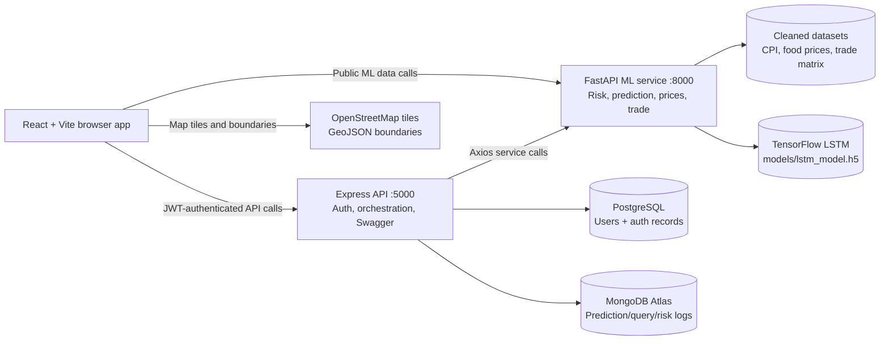

# Food Supply Chain Disruption Analyzer
> A full-stack decision-support platform that turns food-price, consumer-price, and trade data into country risk signals, forecasts, and explainable supply-chain views.

## Overview
Food shocks are not isolated events. A price spike, a fragile import dependency, and a country-level inflation signal can reinforce one another. This project brings those signals into one working experience:
- **Risk intelligence:** CPI-based country risk levels for a selected year
- **Forecasting:** LSTM-powered food-price forecasting with commodity trend projections
- **Trade visibility:** Top import and export partners for a selected country and commodity
- **Operational UI:** Dashboard KPIs, world risk map, alerts, prediction history, and admin controls
- **Auditable data path:** Cleaned CSV datasets and model outputs remain visible through service APIs
The application is deliberately split into a product layer and a data/ML layer. That makes the demo easy to understand, the services independently testable, and future model upgrades less disruptive to the frontend.

## Architecture



### Why three services?

| Service | Responsibility | Port | Technology |
| --- | --- | --- | --- |
| `frontend` | Navigation, auth state, charts, map, user workflows | `5173` | React, Vite, Recharts, Leaflet |
| `backend` | JWT auth, API protection, persistence, orchestration, Swagger | `5000` | Node.js, Express, Sequelize, Mongoose |
| `ml_service` | Dataset loading, risk calculation, forecasting, trade aggregation | `8000` | Python, FastAPI, pandas, scikit-learn, TensorFlow |

### Storage responsibilities

- **PostgreSQL:** relational user records managed through Sequelize
- **MongoDB Atlas:** prediction logs, query logs, and risk alert history
- **Local ML assets:** cleaned CSV files and the trained LSTM model used by FastAPI
The split is intentional: relational data handles identity and constraints, document data handles evolving analytics logs, and the ML service can read large analytical files without making the Node API responsible for Python model execution.

## Request Flows

### Authenticated dashboard flow

```mermaid
sequenceDiagram
	participant U as Browser
	participant E as Express
	participant P as PostgreSQL
	participant M as FastAPI
	participant A as MongoDB
	U->>E: POST /api/auth/login
	E->>P: Find user by email
	P-->>E: Password hash and role
	E-->>U: JWT token
	U->>E: GET /api/data/risk with Bearer token
	E->>M: GET /risk?year=...
	M-->>E: Country CPI and risk levels
	E->>A: Save risk snapshot/logs
	E-->>U: Dashboard-ready JSON

### Map and trade flow

1. The browser loads country boundaries from GeoJSON and map tiles from OpenStreetMap.
2. The map requests authenticated risk data through Express.
3. Selecting a country calls FastAPI `/trade` with the country and commodity.
4. FastAPI filters the cleaned trade matrix, aggregates imports and exports, and returns the top five partners.
5. The UI draws the risk-colored country layer and trade route polylines.

## Data and Model Layer

### Inputs

- `clean_consumer_price_indices.csv`: CPI history used for year-specific country risk
- `clean_food_price_indices.csv`: food price and commodity history used for forecasts
- `clean_trade_matrix.csv`: reporter, partner, commodity, element, year, unit, and value fields
- `models/lstm_model.h5`: trained TensorFlow model for the food price index forecast
The trade matrix is intentionally kept outside the web bundle. It is large enough that loading it into a browser would be wasteful and would expose analytical data unnecessarily; FastAPI loads and aggregates it server-side.

### Risk calculation

For the selected year, the latest valid CPI observation per country is classified as:

| CPI value | Risk |
| ---: | --- |
| `> 300` | `CRITICAL` |
| `> 150` | `HIGH` |
| `> 110` | `MEDIUM` |
| otherwise | `LOW` |

### Forecast calculation

- The LSTM model forecasts six future months of the Food Price Index.
- Commodity series use a transparent recent linear-trend projection.
- The API also returns historical values, previous prices, and forecast bounds so the UI can show context instead of a single unexplained number.

## API Surface

### FastAPI ML service

| Method | Endpoint | Purpose |
| --- | --- | --- |
| `GET` | `/health` | Dataset and model readiness |
| `GET` | `/predict` | Current prices, historical series, and six-month forecast |
| `GET` | `/risk?year=2025` | Country risk data and available years |
| `GET` | `/food-prices?commodity=Cereals` | Historical commodity values |
| `GET` | `/trade?country=India&commodity=Cereals` | Top import/export partners |

### Express API

| Method | Endpoint | Auth |
| --- | --- | --- |
| `GET` | `/` | Public health response |
| `POST` | `/api/auth/register` | Public |
| `POST` | `/api/auth/login` | Public |
| `GET` | `/api/auth/me` | JWT |
| `GET` | `/api/data/predict` | JWT |
| `GET` | `/api/data/predict/history` | JWT |
| `GET` | `/api/data/risk` | JWT |
| `GET` | `/api/data/risk/history` | JWT |
| `POST` | `/api/data/thresholds` | JWT/admin flow |
| `GET` | `/api/docs` | Swagger UI |

## Run Locally

Use **three separate PowerShell terminals**. Keep each service terminal open.

### 1. Start the ML service

```powershell
cd "C:\Users\Admin\OneDrive\Desktop\food-supply-analytics\ml_service"
.\venv\Scripts\activate
uvicorn app.main:app --reload
```

Expected URL: `http://127.0.0.1:8000`

### 2. Start the backend

```powershell
cd "C:\Users\Admin\OneDrive\Desktop\food-supply-analytics\backend"
npm install
npm start
```

Expected URL: `http://127.0.0.1:5000`

The backend requires PostgreSQL and MongoDB Atlas values in `backend/.env`. Use the exact MongoDB driver URI generated by Atlas and do not wrap it in angle brackets.

### 3. Start the frontend

```powershell
cd "C:\Users\Admin\OneDrive\Desktop\food-supply-analytics\frontend"
npm install
npm run dev
```

Expected URL: `http://localhost:5173`

### Quick checks

```powershell
Invoke-WebRequest http://127.0.0.1:8000/health
Invoke-WebRequest http://127.0.0.1:5000/
Invoke-WebRequest http://localhost:5000/api/docs/
```

The map, dashboard, alerts, and predictions require login because their Express data routes require a JWT. If port `8000` or `5000` is already in use, do not start a duplicate service; check the existing process first.

## Demonstration Workflow

1. Open the landing page and register a demo user.
2. Open **Dashboard** and select a year from `2018` through `2025`.
3. Show the KPI cards, risk counts, forecast trend, and top-risk countries.
4. Open **Supply Chain Map** and search for a country.
5. Select a commodity and country to reveal import/export routes.
6. Open **Predictions** to compare commodity histories and six-month projections.
7. Open **History** to show persisted prediction requests and analytics records.
8. Use `/api/docs` to demonstrate that the service contract is inspectable.

## Security and Reliability Notes

- Passwords are hashed with bcrypt before storage.
- JWTs are signed with `JWT_SECRET` and expire after seven days.
- Helmet, CORS, compression, JSON parsing, and API rate limiting are enabled in Express.
- Secrets belong in `backend/.env`; never commit real database passwords or JWT secrets.
- Authenticated pages redirect to login instead of rendering misleading empty data.
- The frontend uses explicit `127.0.0.1` service URLs for reliable Windows local development.
- The map uses key-free OpenStreetMap tiles and GeoJSON boundaries; no Google Maps or Mapbox key is required.

## Why We Did Not Host Everything on a Tiny/Small Tier

This is not a good fit for one minimal shared hosting process. The constraint is architectural, not cosmetic:

1. **TensorFlow startup cost:** importing TensorFlow and loading the LSTM model consumes substantially more memory and CPU than a static frontend or a small Node API.
2. **Large analytical files:** the trade matrix is roughly 182 MB locally, and pandas needs additional working memory while loading, filtering, and aggregating it.
3. **Cold starts hurt the demo:** a sleeping ML container makes the first forecast request slow, which looks like a broken dashboard during a live presentation.
4. **Three independent runtimes:** React/Vite, Node/Express, and Python/FastAPI have different buildpacks, process lifecycles, and dependency footprints.
5. **Two external databases:** PostgreSQL and MongoDB Atlas need stable credentials, network access, and connection handling; a tiny ephemeral host adds another failure surface.
6. **Ephemeral storage is unsafe for model/data assets:** redeploys can remove local files unless the datasets and model are packaged or stored in durable object storage.
7. **Resource contention:** running TensorFlow inference, pandas work, Node requests, and a frontend server on one small instance creates unpredictable latency.

### Sensible deployment shape

- Host the compiled React frontend as static assets on a CDN or static host.
- Run Express as a small always-on API service.
- Run FastAPI as a memory-aware service with the model packaged in the image or mounted from durable storage.
- Keep PostgreSQL and MongoDB as managed databases.
- Move the trade matrix to object storage or a database-backed analytical layer when traffic grows.

For local development, execution is reliable because all datasets are present, the model has no cold-start download, and database connections are easy to observe. For production, the services should be deployed separately with health checks, secrets management, persistent storage, and resource limits.

## Current Limitations and Next Steps

- Add automated backend and ML integration tests.
- Add request timeouts and structured error responses for all frontend API calls.
- Add pagination or pre-aggregated tables for trade analytics at larger scale.
- Cache risk snapshots and forecast responses to reduce repeated model work.
- Add background jobs for model retraining instead of training or preparing data during web requests.
- Add observability for latency, model version, dataset version, and failed database calls.
- Add a production deployment configuration with separate services and managed secrets.

## Repository Layout

```text
backend/
	server.js                 Express entry point
	src/controllers/          Auth and analytics orchestration
	src/models/               PostgreSQL and MongoDB models
	src/routes/               Auth and data routes
	src/services/             ML/client service helpers
	src/docs/swagger.yaml     API contract

frontend/
	src/App.jsx               Routing and protected pages
	src/pages/                Dashboard, map, alerts, predictions, auth
	src/services/api.js       Browser-to-service API calls
	src/context/              Auth state and JWT lifecycle

ml_service/
	app/main.py               FastAPI endpoints and data logic
	app/data/                 Cleaned analytical datasets
	models/                   Trained LSTM model
```

## License and Data Provenance

Add the applicable dataset licenses and source citations before public deployment. This repository intentionally keeps data processing code close to the source files so provenance and cleaning decisions can be reviewed during judging or handoff.
